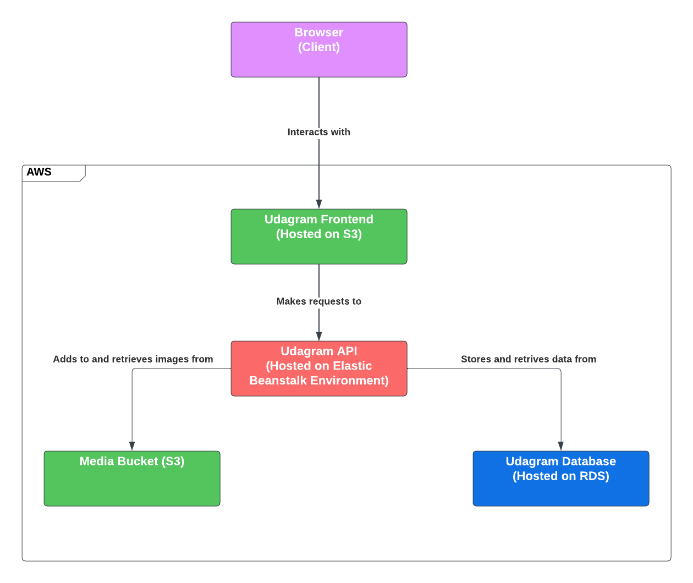

# Infrastructure

* RDS Database instance running Postgres
* Media Bucket (S3): Hosts user upoloaded images
* Udagram Frontend (S3)
* Udagram API: hosted on Elastic beanstalk (EB2) environment, interacts with both the database and the mediabucket to retrieve feed/ image information from db and the actual images from s3 bucket using the file url
