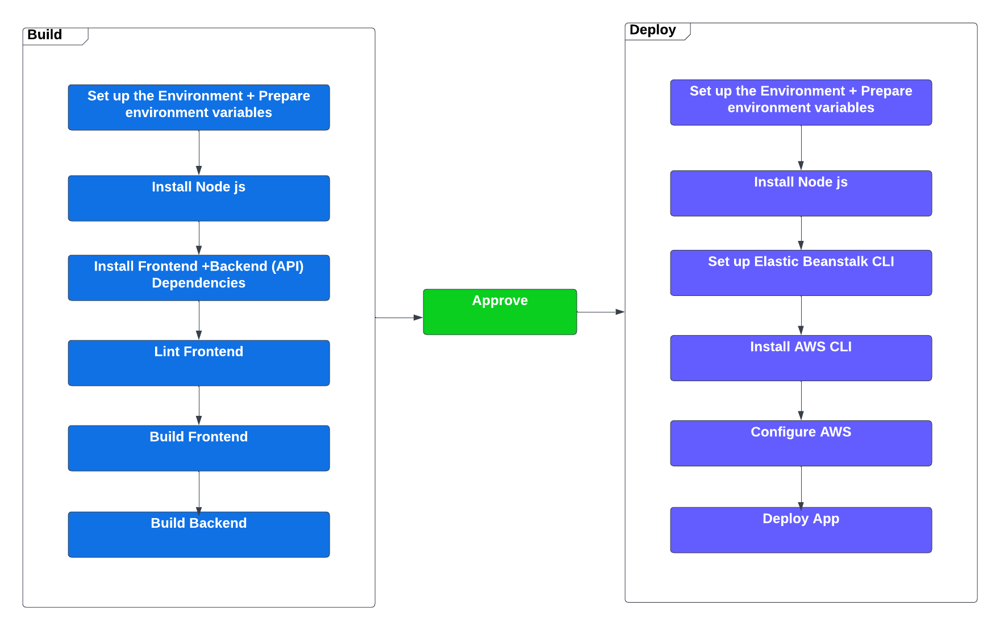

# Pipleline

Pipleline is devided into 2 main stages: Build and Deploy

## Build
a procedure that's responsible for preparing the app and its environment which includes:
* Setting up the environment
* Prepare the env variables
* Install frontend and backend dependencies
* Linting the Frontend
* Building frontend and backend 

once the flow is complete, build needs to be manually approved to be deployed

## Deployment
At this stage we prepare the app to go live and be accessable, the process focuses on interacting with the associated aws resources to deploy the new build. For Udagram this includes:
* Setting up the environment and its variables + Installing node js
* Setting up EB2 CLI
* Setting up AWS CLI + Configure credientials 
* Deploying the app

